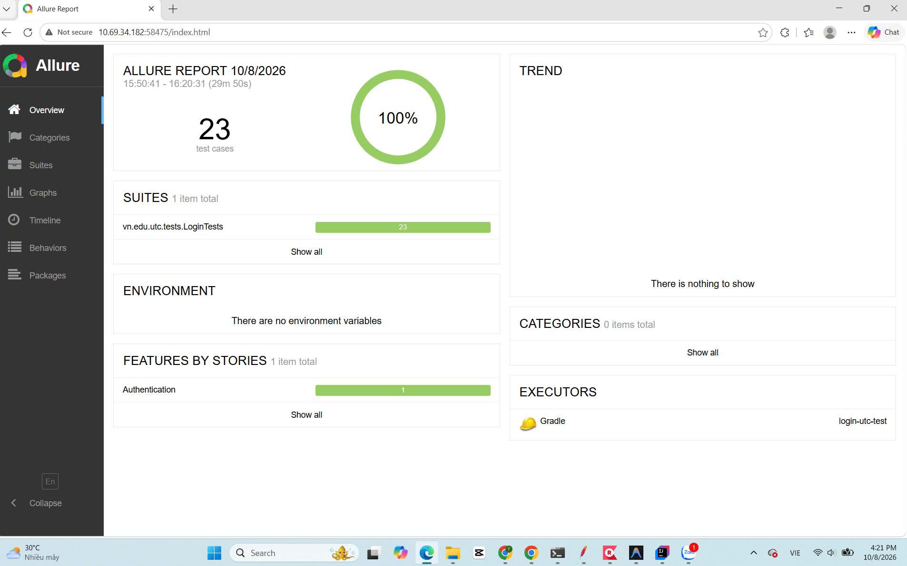

# Du an Kiem thu Tu dong - Dang nhap Van phong Dien tu UTC

## 1. Gioi thieu Du an
Du an nay duoc phat trien nham muc dich kiem thu tu dong (Automation Testing) chuc nang Dang nhap cua he thong Van phong Dien tu Truong Dai hoc Giao thong Van tai (UTC).
Du an ap dung cac cong nghe va mo hinh tieu chuan trong nganh kiem thu phan mem hien nay.




## 2. Cong nghe su dung
- Ngon ngu lap trinh: Java 17
- Framework kiem thu: JUnit 5
- Cong cu tu dong hoa: Selenium WebDriver
- Cong cu quan ly buid: Gradle
- Bao cao kiem thu: Allure Report
- Mo hinh thiet ke: Page Object Model (POM)

## 3. Cau truc thu muc
Toan bo ma nguon duoc to chuc theo mo hinh Page Object Model (POM) giup de dang quan ly va bao tri:

```text
Login-Utc-Test/
├── .github/workflows/          # File cau hinh CI/CD cho Github Actions
├── build/                      # Thu muc chua ket qua sau khi build va test
├── gradle/                     # File cau hinh Gradle Wrapper
├── src/test/java/vn/edu/utc/
│   ├── base/
│   │   └── BaseTest.java       # Khoi tao va cau hinh WebDriver (Chrome)
│   ├── pages/
│   │   └── LoginPage.java      # Dong goi cac phan tu (Locators) va ham xu ly
│   ├── tests/
│   │   ├── LoginTests.java     # Chua 22 kich ban test (Test Cases)
│   │   └── LoginExcelTest.java # Kiem thu Data-driven voi file Excel
│   └── utils/
│       └── ExcelUtils.java     # Tien ich ho tro doc du lieu tu Excel
├── .gitignore                  # Khai bao cac file khong dua len Git
├── build.gradle                # Quan ly thu vien (Selenium, JUnit, Allure)
├── README.md                   # Tai lieu huong dan du an (File ban dang doc)
└── report.png                  # Anh chup bao cao ket qua kiem thu
```

## 4. Danh sach Kich ban Kiem thu (22 Test Cases)
Du an bao phu toan dien cac tinh huong kiem thu tu co ban den nang cao, bao gom:
- Kiem tra giao dien (UI/UX): Hien thi thanh phan, placeholder, URL, Title, Tab thu tu di chuyen...
- Kiem tra chuc nang (Functional): Dang nhap thanh cong, tai khoan sai, mat khau sai, bo trong thong tin...
- Kiem tra bien (Boundary): Chuoi ky tu rat dai, ky tu khoang trang dau cuoi...
- Kiem tra bao mat (Security): SQL Injection, XSS, an ky tu mat khau...
- Kiem tra luu tru phien (Session): Checkbox luu dang nhap...


## 5. Huong dan cai dat va chay chuong trinh
De chay duoc du an nay tren may ca nhan, can thuc hien cac buoc sau:

Buoc 1: Mo Terminal hoac PowerShell tai thu muc goc cua du an.
Buoc 2: Chay lenh sau de thuc thi toan bo 22 kịch ban kiem thu:
  .\gradlew clean test

Buoc 3: Sau khi tien trinh test hoan tat (hien thi BUILD SUCCESSFUL), chay lenh sau de xuat va xem bao cao Allure:
  .\gradlew allureServe

Trinh duyet se tu dong mo ra trang bao cao chi tiet ve so luong test case Pass/Fail.

## 6. Luu y
- Phan mem yeu cau Chrome va thu vien Selenium tu dong tai ChromeDriver phu hop.
- De dam bao report luon hien thi dung so luong, hay luon them tham so "clean" truoc khi chay "test".
